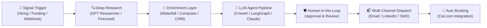

  

  
  
  
  
  
  
  

---

# 🚀 Awesome Sales AI SDR Platforms & Autonomous Agents

> A comprehensive, SEO-curated directory and landscape of **Sales AI Development Representatives (AI SDRs)**, **AI Business Development Representatives (AI BDRs)**, **Autonomous Outbound Agents**, **AI Cold Outreach Engines**, and **Open-Source Sales Agent Frameworks**.

**Last updated:** September 2026 • **Maintained by:** [@ishandutta2007](https://github.com/ishandutta2007)

---

## 📌 Table of Contents

- [🌟 Overview & Market Landscape](#-overview--market-landscape)
- [⚡ Core Capabilities of Modern AI SDRs](#-core-capabilities-of-modern-ai-sdrs)
- [💼 SaaS & Hosted AI SDR Platforms](#-saashosted-platforms)
- [🛠️ Open-Source GitHub Projects](#️-open-source-github-projects)
- [🏗️ Architectural Blueprint for Custom AI SDRs](#️-architectural-blueprint-for-custom-ai-sdrs)
- [💡 Strategy: SaaS vs. Open-Source](#-strategy-saas-vs-open-source)
- [📈 Star History](#-star-history)
- [🤝 How to Contribute](#-how-to-contribute)
- [⚠️ Disclaimer & Compliance](#️-disclaimer--compliance)

---

## 🌟 Overview & Market Landscape

The B2B Go-To-Market (GTM) motion is experiencing a seismic shift. Traditional manual SDR cadences are being revolutionized by **Autonomous AI SDR platforms** and **Agentic Outbound Pipelines**.

These AI agents autonomously:
1. 🔍 **Prospect & Enrich**: Crawl verified data sources, funding databases, hiring boards, and social signals.
2. 🧠 **Deep Research**: Analyze company 10-K filings, recent news, tech stacks, and buyer personality profiles.
3. ✍️ **Hyper-Personalize**: Compose 1-to-1 tailored value propositions and cold outreach sequences across email, LinkedIn, and messaging platforms.
4. 📬 **Manage Deliverability & Warmup**: Protect sender reputation with AI domain rotation and inbox warmup.
5. 💬 **Triage Inbound & Handle Objections**: Comprehend prospect responses, address concerns, and coordinate meeting bookings via calendar integrations.

> 📊 **Market Dynamics:** The global AI SDR & Sales Agent market is projected at **~$4.4B – $5.0B in 2025/2026** and accelerating past **$15B–$40B+ by 2030–2034** (~30% CAGR). The ecosystem is highly dynamic, bridging specialized AI-native autonomous agents and enterprise CRM platforms.

---

## ⚡ Core Capabilities of Modern AI SDRs

| Capability | What It Does | Key Benefit |
| :--- | :--- | :--- |
| 🕵️ **Intent-Driven Prospecting** | Detects job postings, funding events, executive departures, and tech changes | Reaches buyers during peak purchase intent |
| 🧬 **Buyer Intelligence Profiling** | Evaluates DISC/Big-Five psychological profiles and writing preferences | Maximizes email open, reply, and engagement rates |
| 🛡️ **Deliverability Protection** | Handles SPF, DKIM, DMARC, automated rotation, and inbox ramp-up | Keeps messages out of the spam filter |
| 🔄 **Multi-Channel Orchestration** | Coordinates cohesive cadences across Cold Email, LinkedIn, SMS, and WhatsApp | Delivers unified prospect engagement |
| 📅 **Autonomous Calendar Booking** | Converses with prospects and books confirmed meetings onto reps' calendars | Eliminates manual scheduling friction |

---

## 💼 SaaS/Hosted Platforms

A curated comparison of leading enterprise and mid-market AI SDR SaaS platforms.

| Platform | Description | Scale & Funding | Pricing | Free Tier Limits |
| :--- | :--- | :--- | :--- | :--- |
| **[11x.ai](https://www.11x.ai/)** | Multi-channel autonomous prospecting, research, outreach, and follow-up (Alice & Jordan). | **~$350M valuation** ($76M raised, ~$10M ARR) | Starts at $3,750/month (billed annually at $45,000/yr for Growth tier; 2,000 new prospects/mo, 5 seats) | No free tier or trial; sales-led demo with sample outreach run only |
| **[Landbase](https://www.landbase.com/)** | Autonomous GTM platform delivering contact intelligence, predictive scoring, and multi-channel campaign execution. | **~$150M+ valuation** ($43M raised, ~$10.7M ARR) | Starts at $499/month (Data enrichment bundle; 15,000 verified contact credits) or $3,000/month for full autonomous platform | Free forever tier: 1,000 free credits at signup for audience discovery, campaign planning, and draft generation (sending disabled) |
| **[Regie.ai](https://www.regie.ai/)** | AI prospecting agents and automated sequence content generation that integrates into sales workflows. | **~$150M est. valuation** ($65.6M raised, ~$8M+ ARR) | Starts at $49/month (RegieGO Pro; $40/mo billed annually) or $180/user/month (RegieOne Team; 10-seat min) | Free forever plan (RegieGO): 250 one-time credit allotment for research, drafting, and Chrome extension |
| **[Artisan AI](https://www.artisan.co/)** | Full-stack outbound platform with AI BDR Ava managing research, copywriting, and multi-channel outreach. | **~$120M–$150M est. valuation** ($48.3M raised, ~$6M ARR) | Starts at $250/month (billed annually for Intern plan; includes 12,000 credits) | Free forever plan: 300 credits/month, 1 AI SDR (Ava), basic campaign tools & CRM sync |
| **[Jason AI by Reply.io](https://reply.io/)** | Autonomous AI SDR module built into Reply.io for automated cold email, LinkedIn sequences, and handling responses. | **~$14.7M ARR** (~$80M–$100M valuation, bootstrapped) | Starts at $500/month (billed annually; includes active contact management & multi-channel automation) | 14-day free trial (Reply.io core platform): includes basic AI template generator, 200 email search credits, and sequence tools (autonomous Jason AI agent requires demo/paid tier) |
| **[Octave](https://www.octavehq.com/)** | AI agent platform for B2B outbound messaging, value proposition modeling, and pipeline acceleration. | **~$30M–$40M est. valuation** ($8.4M raised, Seed) | Starts at $149/month ($119/month billed annually for Core plan; 4,000 credits, 8 playbooks, 24 agents) | Free forever plan (Lite): 100 credits, 2 workspaces, 2 playbooks, 4 agents, and community support |
| **[Humantic AI](https://humantic.ai/)** | Buyer intelligence and personality profiling (DISC/Big Five) for hyper-personalized messaging and pitch optimization. | **~$4M ARR** (~$15M–$20M valuation, $1.5M raised) | Starts at $90/month (billed annually at $1,080/yr for Individual/Starter tier) | 7-day free trial: provides full platform access up to 50 personality profile reports without requiring a credit card |
| **[Agent Frank (Salesforge)](https://www.salesforge.ai/)** | Autonomous AI outbound rep managing lead enrichment, deliverability, personalized cold email, and follow-ups. | **~$3M ARR** (~$12M–$15M valuation, $500K raised) | Starts at $499/month (Agent Frank base tier, quarterly/annual commitment; 1,000 active contacts managed) | No free tier or trial; personalized 1-on-1 demo with custom ICP and sequence configuration |
| **[AiSDR](https://aisdr.com/)** | Autonomous outbound email and LinkedIn SDR agent targeting intent leads and booking qualified meetings. | **~$2M ARR** (~$10M–$12M valuation, $3.2M raised) | Starts at $250/month (Solo plan, month-to-month; 200 AI-researched contacts, 1 domain, 3 mailboxes) | No free tier or platform trial; interactive AI Strategist demo generates 1 free custom outbound GTM campaign plan |
| **[Persana AI](https://persana.ai/)** | AI sales prospecting engine with multi-source waterfall enrichment and intelligent agent workflows. | **~$10M–$12M est. valuation** ($3.1M raised, YC) | Starts at $85/month ($68/month billed annually; includes 7,500 enrichment credits/mo) | Free forever plan: 50 credits/month, basic enrichment lookups, and standard CRM integration |

---

## 🛠️ Open-Source GitHub Projects

Notable open-source repositories, agentic templates, and developer toolkits for engineering custom AI SDRs and automated sales pipelines.

> ℹ️ *Sorted in descending order by GitHub_Stars.*

- **[Twenty](https://github.com/twentyhq/twenty)**   
  ⚡ *The open-source CRM alternative to Salesforce*, designed natively for AI agents, automated sales pipelines, and customizable CRM workflows.

- **[Cal.com](https://github.com/calcom/cal.com)**   
  📅 *Open-source scheduling and meeting booking infrastructure*, widely embedded into AI SDR agents for autonomous meeting handoffs and qualification booking.

- **[Composio](https://github.com/ComposioHQ/composio)**   
  🔌 *Agent tooling and integration platform* providing 1000+ connectors (Gmail, HubSpot, Salesforce, Slack, LinkedIn) to build custom autonomous sales and SDR agent workflows.

- **[GPT Researcher](https://github.com/assafelovic/gpt-researcher)**   
  🔬 *Autonomous deep research agent* capable of executing comprehensive multi-source prospect, company intelligence, and account-level research for personalized outbound.

- **[SalesGPT](https://github.com/filip-michalsky/SalesGPT)**   
  💬 *Open-source, context-aware AI sales agent architecture* for multi-stage sales conversations, objection handling, qualification, and automated multi-channel dialogue.

- **[Warmbly](https://github.com/warmbly/warmbly)**   
  🔥 *Open-source cold outreach and email deliverability warmup platform* designed to protect sender domain reputation during automated sales cadences.

- **[B2B SDR Agent Template](https://github.com/iPythoning/b2b-sdr-agent-template)**   
  🤖 *Production-oriented open template* for building autonomous multi-channel AI SDRs (WhatsApp, Telegram, Email) featuring a 10-stage sales pipeline and multi-engine memory.

- **[Email-automation](https://github.com/PaulleDemon/Email-automation)**   
  ✉️ *Open-source cold email scheduling, dispatch, and sequence outreach tool* for managing outbound campaigns.

- **[GenAI Cold Email Generator](https://github.com/codebasics/project-genai-cold-email-generator)**   
  🎯 *End-to-end cold email generation engine* utilizing Llama 3.1, LangChain, ChromaDB, and web scraping to extract job/company context and draft targeted pitches.

- **[Forward Deployed Selling](https://github.com/vonarmen-wq/forward-deployed-selling)**   
  ⚔️ *Enterprise sales methodology and tactical sales skills framework* implemented for AI agents and Claude Code to execute outbound research and account planning.

- **[Awesome AI Agents for Sales](https://github.com/Salesably/awesome-ai-agents-for-sales)**   
  📚 *Curated list and ecosystem map* of open-source AI sales agents, prospecting frameworks, and sales intelligence tools.

- **[OpenSDR](https://github.com/MatthewDailey/open-sdr)**   
  💻 *Command-line AI SDR tool* designed to automate prospect company research, qualification, and outbound lead generation workflows.

- **[AI-SDR (n8n Workflow)](https://github.com/AntraTripathi74/AI-SDR)**   
  🔄 *n8n workflow blueprint* that automates lead discovery, web scraping, Google search research, Gemini 1.5 enrichment, and personalized draft generation.

- **[AI SDR/BDR Agent](https://github.com/brightdata/ai-sdr-bdr-agent)**   
  🌐 *AI-powered BDR system* that automates lead discovery, business trigger detection, contact enrichment, and personalized outreach.

- **[OpenCloser](https://github.com/issacops/opencloser-v2)**   
  🖥️ *Open-source, local-first AI sales platform* with strategist, lead researcher, voice caller (SDR), coach, and manager agents running on desktop with CRM capabilities.

- **[opensource-sales-ops](https://github.com/mukul-07/opensource-sales-ops)**   
  🧑‍💻 *Local-first, human-in-the-loop AI SDR pipeline for Claude Code* — scans prospects, qualifies leads, drafts outreach, and manages cadences without auto-sending.

- **[ai-sdr (CrewAI Multi-Agent)](https://github.com/avcap/ai-sdr)**   
  👥 *Multi-agent AI SDR platform using CrewAI* for autonomous prospecting, lead personalization, outreach drafting, and campaign coordination.

- **[FundzWatch AI SDR](https://github.com/Fund-z/fundzwatch-ai-sdr)**   
  💰 *Event-driven open-source AI SDR agent* that discovers, scores, and crafts personalized outreach based on real-time corporate events (funding rounds, executive hires).

- **[AI-Powered Cold Email Generator](https://github.com/v26199/AI-Powered-Cold-Email-Generator)**   
  ⚡ *Cold email generation agent* leveraging GroqCloud and Llama 3 to analyze target websites and generate tailored cold email pitches.

- **[AI BDR Agent](https://github.com/mikegrowsgreens/ai-bdr-agent)**   
  📊 *Autonomous AI BDR agent built using n8n*, Claude AI, and Google Sheets for automated lead scoring, enrichment, and multi-touch email sequencing.

- **[Outreach-CLI](https://github.com/LevelVoid/Outreach-CLI)**   
  🛠️ *Automated cold outreach command-line tool* integrating lead enrichment and email sending pipelines.

---

## 🏗️ Architectural Blueprint for Custom AI SDRs

For engineering teams building custom AI SDR agents, the recommended stack combines:

---

## 💡 Strategy: SaaS vs. Open-Source

| Dimension | Hosted SaaS (11x, Artisan, Landbase) | Custom Open-Source (CrewAI, Twenty, Composio) |
| :--- | :--- | :--- |
| ⏱️ **Time to Value** | Instant (Out of the box) | Requires setup, coding & pipeline tuning |
| 🛡️ **Deliverability & Warmup** | Built-in managed infrastructure | Self-managed DNS, warmup, and mailbox rotation |
| 🔒 **Data Privacy & Residency** | Multi-tenant cloud | Full on-premise / private cloud control |
| 💰 **Cost Structure** | Subscription tiers ($250 – $3,750+/mo) | LLM token usage + infra hosting costs |
| 🛠️ **Customization** | Constrained to vendor playbooks | Unlimited programmatic flexibility |

---

## 📈 Star History

---

## 🤝 How to Contribute

Contributions, project submissions, and suggestions are welcome!

1. 🍴 Fork the repository.
2. 🌿 Create a new feature branch (`git checkout -b feature/add-sdr-tool`).
3. 📝 Add your entry into `README.md` following the alphabetical / star-ranked format with factual descriptions and links.
4. 🚀 Open a Pull Request with a clear summary of the added platform or open-source tool.

⭐ **Star the repo** if you find it helpful!

---

## ⚠️ Disclaimer & Compliance

- This repository is a **community-curated index** intended for research, evaluation, and engineering purposes.
- Automated outbound and cold messaging tools must comply with global data protection and anti-spam regulations, including **CAN-SPAM**, **GDPR**, **CASL**, and respective platform Terms of Service.
- Always maintain human oversight, monitor sender domain health, and respect opt-out requests.

---

  Built with ❤️ for sales leaders, GTM engineers, and AI developers.

